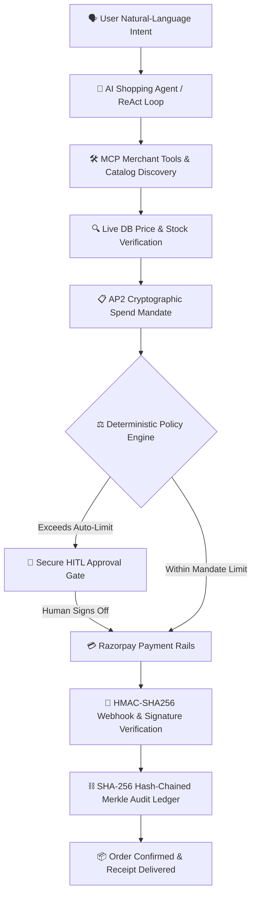

# AgentCart Pro — Trustworthy Autonomous Commerce Agent with Policy-Controlled Payments

<div align="center">

[](https://agentcart-pro.vercel.app)
[](https://github.com/Navin-35/Agentcart-pro)
[](https://github.com/Navin-35/Agentcart-pro/actions)
[](backend/tests/)

<br/>

[](https://www.python.org/)
[](https://fastapi.tiangolo.com/)
[](https://reactjs.org/)
[](https://vitejs.dev/)
[](https://tailwindcss.com/)
[](https://razorpay.com/)
[](https://www.sqlite.org/)
[](LICENSE)

<p align="center">
  <b>A zero-trust autonomous shopping agent that enforces deterministic spending limits, cryptographic mandates, persistent replay defense, and SHA-256 hash-chained audit trails before any payment moves.</b>
</p>

[🌐 Live Production Demo](https://agentcart-pro.vercel.app) • [📖 Architecture Docs](docs/architecture.md) • [🛡️ Security Model](docs/security.md) • [🧪 Test Suite](backend/tests)

</div>

---

## 🎯 Core Philosophy & Problem Statement

Large Language Models (LLMs) are revolutionary for understanding user shopping intents, comparing product specs, discovering merchants, and planning cart checkouts. However:

> ⚠️ **Critical Flaw**: LLMs hallucinate numbers, are vulnerable to prompt injection, and lack mathematical precision. **An LLM must NEVER hold direct, unconstrained financial authority.**

**AgentCart Pro** implements a battle-tested separation of concerns:

```
┌────────────────────────────────────────────────────────┐
│   THE GOLDEN SECURITY RULE:                            │
│   "The AI Agent plans and proposes;                    │
│    Deterministic, Cryptographic Systems authorize."    │
└────────────────────────────────────────────────────────┘
```

---

## 🏗️ Architectural Flow



---

## 🛡️ Key Pillars & Defense Mechanisms

### 1. Deterministic Policy Engine & Anti-Hallucination
* **Live Price Overwrite**: AI-claimed prices are unconditionally discarded. The order is priced strictly from verified, server-side live database records.
* **Formal Mathematical Invariant Proof**: Uses integer-paise math (`Paise = SUM(Unit_Paise * Qty) - Discount + Tax`) generating an immutable SHA-256 calculation proof.
* **Hard Spend Ceilings**: Enforces per-transaction caps and daily limits that cannot be bypassed via prompt manipulation.

### 2. AP2 Cryptographic Spend Mandates
* Inspired by the Google/W3C Agentic Payment Protocol (AP2) and Unified Agentic Payments (UAP) standards.
* Users grant bounded authority (`AgentSpendMandate`) defining spending ceilings, category whitelists, merchant trust thresholds, and TTL expirations.
* Every mandate is cryptographically sealed with **HMAC-SHA256** signatures for tamper-evidence.

### 3. Secure Human-in-the-Loop (HITL) Gate
* If a purchase exceeds the user's autonomous pre-authorization ceiling, the transaction automatically suspends in state `AWAITING_APPROVAL`.
* Emits a secure, random server-side `approval_id`.
* The client dashboard approves using **only** `(session_id, approval_id)` — preventing client-side amount tampering.

### 4. Persistent Replay & Idempotency Defense
* Enforces HMAC-SHA256 idempotency keys persisted in SQLite with unique database constraints.
* Prevents double-spending, race conditions, and replay attacks **even across server restarts or container reboots**.

### 5. 7-Stage Linear State Machine
* Enforces strict monotonic progression:
  $$\text{INTENT\_RECEIVED} \rightarrow \text{DISCOVERING} \rightarrow \text{QUOTED} \rightarrow \text{VERIFYING} \rightarrow \text{AWAITING\_APPROVAL} \rightarrow \text{AUTHORIZED} \rightarrow \text{PAID}$$
* Invalid out-of-order state transitions are rejected with HTTP 409 Conflict.

### 6. SHA-256 Hash-Chained Audit Ledger
* Every event (tool discovery, quote generation, policy evaluation, human approval, payment settlement) is appended to a cryptographic hash chain:
  $$\text{Hash}_n = \text{SHA-256}(\text{Hash}_{n-1} \parallel \text{EntryData})$$
* Includes a **One-Click Chain Verification** button that recalculates all historical hashes and proves zero tampering.

### 7. Dual-Mode Razorpay Rails
* **Live Test API**: Connects to real Razorpay Test Rails (Orders API, Razorpay Checkout SDK, and Webhook signature verification).
* **High-Fidelity Mock Fallback**: Zero-credential demo mode allowing judges and developers to test end-to-end purchasing flows offline.

---

## 💻 3-Column Enterprise Operations Dashboard

| Column 1: Autonomous Agent | Column 2: Live Merchant Catalog | Column 3: Mandate & Audit Security |
|---|---|---|
| Natural-language conversation stream, autonomous tool invocation badges, reasoning thoughts, and Razorpay modal triggers. | Live store inventory, stock status, category filters, and interactive **Price Surge** / **Stockout** chaos simulators. | AP2 Spend Mandate card, live transaction state badge, and verifiable SHA-256 cryptographic audit ledger. |

---

## 🚀 Quick Start (Local Development)

### Prerequisites
- **Python 3.10+** (Tested on Python 3.11 & 3.13)
- **Node.js 18+ and npm**

### 1. Clone the Repository
```bash
git clone https://github.com/Navin-35/Agentcart-pro.git
cd Agentcart-pro
```

### 2. Start Backend (FastAPI)
```bash
cd backend
python -m venv venv

# Windows:
.\venv\Scripts\Activate.ps1
# macOS/Linux:
source venv/bin/activate

pip install -r requirements.txt
python -m uvicorn app.main:app --reload --port 8000
```
> 📖 Interactive API Docs: [http://localhost:8000/docs](http://localhost:8000/docs)

### 3. Start Frontend (React + Vite)
```bash
cd ../frontend
npm install
npm run dev
```
> 🌐 Web Dashboard: [http://localhost:3000](http://localhost:3000)

---

## 🐳 Docker Compose (One-Click)

Run both backend and frontend isolated in Docker:
```bash
docker-compose up --build
```
- Frontend: `http://localhost:5173`
- Backend: `http://localhost:8000/docs`

---

## ☁️ Cloud Deployment Architecture

AgentCart Pro is architected for instant serverless/PaaS deployment:

```
                  ┌──────────────────────────────┐
                  │    Vercel Global Edge CDN    │
                  │  https://agentcart-pro.vercel.app  │
                  └──────────────┬───────────────┘
                                 │ REST / HTTPS
                                 ▼
                  ┌──────────────────────────────┐
                  │      Render Web Service      │
                  │       (FastAPI Backend)      │
                  └──────────────┬───────────────┘
                                 │
                  ┌──────────────┴───────────────┐
                  ▼                              ▼
          ┌───────────────┐              ┌───────────────┐
          │ Razorpay Test │              │  Persistent   │
          │ Payment Rails │              │ SQLite Engine │
          └───────────────┘              └───────────────┘
```

- **Frontend**: Hosted on [Vercel](https://agentcart-pro.vercel.app) with automatic SPA routing.
- **Backend**: Hosted on [Render](https://render.com) using standard Uvicorn worker threads.

---

## 🧪 Comprehensive Verification Suite

Run all 41 automated tests covering financial safety invariants, anti-hallucination, replay attacks, and state machines:

```bash
cd backend
pytest tests/ -v
```

### Test Results Breakdown:
```text
============================= test session starts =============================
collected 41 items

backend/tests/test_advanced_features.py ....                             [  9%]
backend/tests/test_anti_hallucination.py .                               [ 12%]
backend/tests/test_ap2_mandates.py ...                                   [ 19%]
backend/tests/test_audit_integrity.py .                                  [ 21%]
backend/tests/test_idempotency_persistent.py .....                       [ 34%]
backend/tests/test_idempotency_replay.py .                               [ 36%]
backend/tests/test_mandate.py ........                                   [ 56%]
backend/tests/test_policy_engine.py ...                                  [ 63%]
backend/tests/test_razorpay_gateway.py .                                 [ 65%]
backend/tests/test_secure_hitl.py .....                                  [ 78%]
backend/tests/test_stockout_recovery.py .                                [ 80%]
backend/tests/test_transaction_states.py ........                        [100%]

======================= 41 passed, 3 warnings in 5.26s ========================
```

---

## 🔌 API Reference Overview

| Endpoint | Method | Description |
|---|---|---|
| `GET /` | `GET` | Health status and service information |
| `GET /health` | `GET` | Detailed health report, payment mode, and active mandate ID |
| `POST /api/v1/agent/run` | `POST` | Autonomous agent execution loop with live event stream |
| `POST /api/v1/agent/approve-hitl` | `POST` | Human-in-the-loop cryptographic transaction sign-off |
| `GET /api/v1/agent/mandate` | `GET` | Fetches active AP2 spending mandate & signature |
| `POST /api/v1/agent/mandate` | `POST` | Issues/updates spend authority with HMAC-SHA256 signature |
| `GET /api/v1/catalog` | `GET` | Retrieves verified store catalog with live pricing |
| `POST /api/v1/catalog/simulate-price-surge`| `POST` | Injects price surges to test anti-hallucination defense |
| `POST /api/v1/catalog/simulate-stockout` | `POST` | Injects inventory depletion to test automated stockout recovery |
| `GET /api/v1/audit/verify-chain` | `GET` | Verifies SHA-256 Merkle/hash-chain integrity |
| `POST /api/v1/payments/verify-signature` | `POST` | Cryptographically verifies Razorpay payment signature |

---

## 📂 Project Structure

```text
agentcart-pro/
├── .github/workflows/ci.yml       # Automated GitHub Actions CI pipeline
├── backend/
│   ├── app/
│   │   ├── agent/                 # ReAct autonomous reasoner & MCP discovery tools
│   │   ├── api/v1/                # Clean FastAPI route handlers
│   │   ├── core/                  # Configuration, settings & security helpers
│   │   ├── models/                # Strict Pydantic domain schemas
│   │   └── services/              # Policy engine, Mandates, SQLite & Razorpay rails
│   ├── tests/                     # 41 unit & security tests
│   └── requirements.txt           # Backend dependencies
├── frontend/
│   ├── src/
│   │   ├── components/            # 3-column dashboard, modals, mandate panels
│   │   ├── services/              # API layer with dynamic cloud baseUrl
│   │   └── types/                 # TypeScript interfaces
│   ├── package.json               # React 18, Vite, Lucide & TailwindCSS
│   └── vite.config.ts             # Vite configuration with network binding & proxy
├── docs/
│   ├── architecture.md            # Comprehensive system design specification
│   └── security.md                # Threat model and financial safety proofs
├── render.yaml                    # Render Cloud Web Service blueprint
├── vercel.json                    # Vercel SPA routing configuration
├── docker-compose.yml             # Container orchestration
└── README.md                      # Project documentation & showcase
```

---

## 👥 Authors & Recognition

Developed by **[Navin Kumar](https://github.com/Navin-35)**.

* Built for the **Razorpay Agentic AI Hackathon** & Autonomous Commerce Research.
* Inspired by AP2 (Agentic Payment Protocol) & UAP (Unified Agentic Payments) research drafts.

---

## 📄 License

This project is licensed under the [MIT License](LICENSE).
